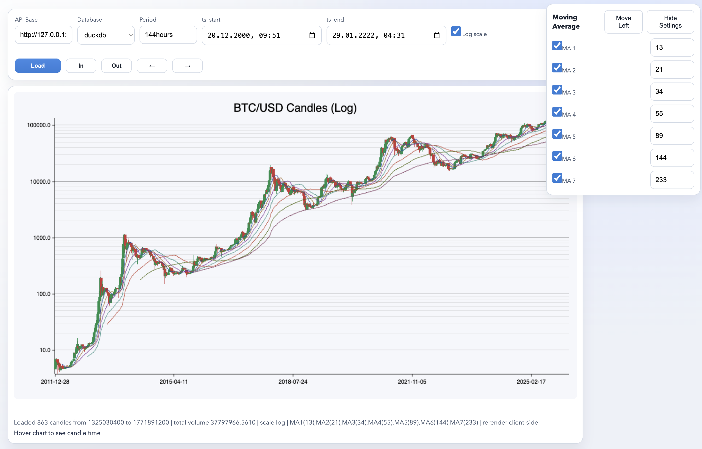
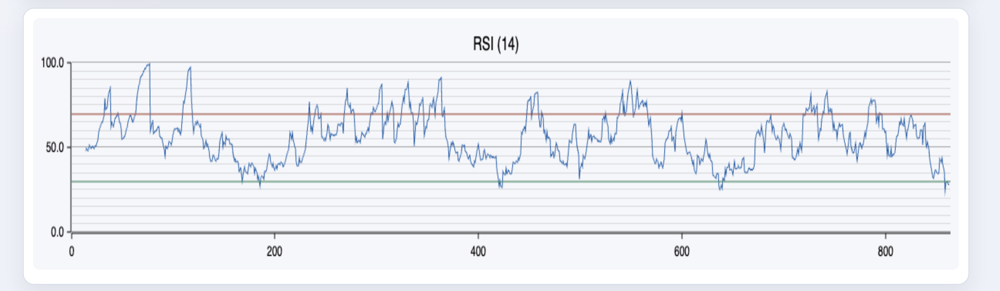

#### Bench marks for db

### Data sources
```
https://ff137.github.io/bitstamp-btcusd-minute-data/

curl -O https://raw.githubusercontent.com/ff137/bitstamp-btcusd-minute-data/main/data/historical/btcusd_bitstamp_1min_2012-2025.csv.gz
gunzip btcusd_bitstamp_1min_2012-2025.csv.gz

curl -O https://raw.githubusercontent.com/ff137/bitstamp-btcusd-minute-data/main/data/updates/btcusd_bitstamp_1min_latest.csv
```

#### Run servers
```
docker-compose -f docker/pg.yaml up -d
```

#### Extension
```
docker exec -it docker-pg_clickhouse-1 psql -U postgres -c 'CREATE EXTENSION pg_clickhouse'
docker exec -it docker-timescaledb-1 psql -U postgres -c 'SELECT extname, extversion FROM pg_extension'
```

#### Init sql
```
docker exec -i docker-postgres_18-1 psql -U postgres postgres < init_btc_usdt.sql
docker exec -i docker-timescaledb-1 psql -U postgres postgres < init_btc_usdt.sql
docker exec -i docker-pg_clickhouse-1 psql -U postgres postgres < init_btc_usdt.sql
docker exec -i docker-pg_duckdb-1 psql -U postgres postgres < init_btc_usdt.sql
```

#### 
```
#### postgres
docker exec -i docker-postgres_18-1 psql -U postgres -c "COPY btc_usd FROM STDIN WITH (FORMAT CSV, HEADER)" < btcusd_bitstamp_1min_2012-2025.csv
docker exec -i docker-postgres_18-1 psql -U postgres -c "COPY btc_usd FROM STDIN WITH (FORMAT CSV, HEADER)" < btcusd_bitstamp_1min_latest.csv

#### timescaledb
docker exec -i docker-timescaledb-1 psql -U postgres -c "COPY btc_usd FROM STDIN WITH (FORMAT CSV, HEADER)" < btcusd_bitstamp_1min_2012-2025.csv
docker exec -i docker-timescaledb-1 psql -U postgres -c "COPY btc_usd FROM STDIN WITH (FORMAT CSV, HEADER)" < btcusd_bitstamp_1min_latest.csv

#### clickhouse
docker exec -i docker-pg_clickhouse-1 psql -U postgres -c "COPY btc_usd FROM STDIN WITH (FORMAT CSV, HEADER)" < btcusd_bitstamp_1min_2012-2025.csv
docker exec -i docker-pg_clickhouse-1 psql -U postgres -c "COPY btc_usd FROM STDIN WITH (FORMAT CSV, HEADER)" < btcusd_bitstamp_1min_latest.csv

#### duckdb
docker exec -i docker-pg_duckdb-1 psql -U postgres -c "COPY btc_usd FROM STDIN WITH (FORMAT CSV, HEADER)" < btcusd_bitstamp_1min_2012-2025.csv
docker exec -i docker-pg_duckdb-1 psql -U postgres -c "COPY btc_usd FROM STDIN WITH (FORMAT CSV, HEADER)" < btcusd_bitstamp_1min_latest.csv
```

#### API server
```
cargo run -p price-api-server
```

#### UI (plotters-rs via wasm)
```
rustup target add wasm32-unknown-unknown
cargo install trunk
cd apps/ui_web
trunk serve index.html --open
```

### Screenshots





### Append data example
```
curl -O https://raw.githubusercontent.com/ff137/bitstamp-btcusd-minute-data/main/data/updates/btcusd_bitstamp_1min_latest.csv
docker exec docker-pg_duckdb-1 psql -U postgres -c "SELECT max(timestamp) from btc_usd"
sed '1,/^1771981140/d' btcusd_bitstamp_1min_latest.csv > btcusd_bitstamp_1min_latest_patch.csv
docker exec -i docker-pg_duckdb-1 psql -U postgres -c "COPY btc_usd FROM STDIN WITH (FORMAT CSV, HEADER)" < btcusd_bitstamp_1min_latest_patch.csv
```
