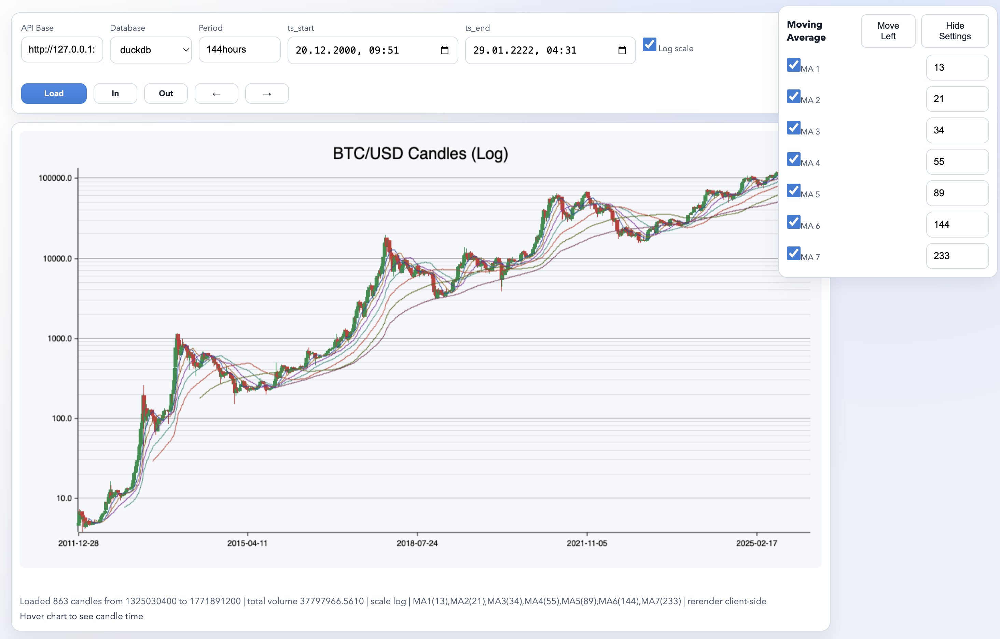
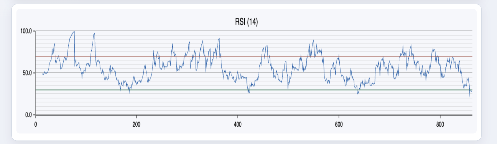

#### Bench marks for db

## BTC
### Data sources
```
https://ff137.github.io/bitstamp-btcusd-minute-data/

curl -O https://raw.githubusercontent.com/ff137/bitstamp-btcusd-minute-data/main/data/historical/btcusd_bitstamp_1min_2012-2025.csv.gz
gunzip btcusd_bitstamp_1min_2012-2025.csv.gz

curl -O https://raw.githubusercontent.com/ff137/bitstamp-btcusd-minute-data/main/data/updates/btcusd_bitstamp_1min_latest.csv
```

#### Run servers
```
docker-compose -f docker/pg.yaml up -d
```

#### Extension
```
docker exec -it docker-pg_clickhouse-1 psql -U postgres -c 'CREATE EXTENSION pg_clickhouse'
docker exec -it docker-timescaledb-1 psql -U postgres -c 'SELECT extname, extversion FROM pg_extension'
```

#### Init btc sql
```
docker exec -i docker-postgres_18-1 psql -U postgres postgres < init_btc_usdt.sql
docker exec -i docker-timescaledb-1 psql -U postgres postgres < init_btc_usdt.sql
docker exec -i docker-pg_clickhouse-1 psql -U postgres postgres < init_btc_usdt.sql
docker exec -i docker-pg_duckdb-1 psql -U postgres postgres < init_btc_usdt.sql
```

#### 
```
#### postgres
docker exec -i docker-postgres_18-1 psql -U postgres -c "COPY btc_usd FROM STDIN WITH (FORMAT CSV, HEADER)" < btcusd_bitstamp_1min_2012-2025.csv
docker exec -i docker-postgres_18-1 psql -U postgres -c "COPY btc_usd FROM STDIN WITH (FORMAT CSV, HEADER)" < btcusd_bitstamp_1min_latest.csv

#### timescaledb
docker exec -i docker-timescaledb-1 psql -U postgres -c "COPY btc_usd FROM STDIN WITH (FORMAT CSV, HEADER)" < btcusd_bitstamp_1min_2012-2025.csv
docker exec -i docker-timescaledb-1 psql -U postgres -c "COPY btc_usd FROM STDIN WITH (FORMAT CSV, HEADER)" < btcusd_bitstamp_1min_latest.csv

#### clickhouse
docker exec -i docker-pg_clickhouse-1 psql -U postgres -c "COPY btc_usd FROM STDIN WITH (FORMAT CSV, HEADER)" < btcusd_bitstamp_1min_2012-2025.csv
docker exec -i docker-pg_clickhouse-1 psql -U postgres -c "COPY btc_usd FROM STDIN WITH (FORMAT CSV, HEADER)" < btcusd_bitstamp_1min_latest.csv

#### duckdb
docker exec -i docker-pg_duckdb-1 psql -U postgres -c "COPY btc_usd FROM STDIN WITH (FORMAT CSV, HEADER)" < btcusd_bitstamp_1min_2012-2025.csv
docker exec -i docker-pg_duckdb-1 psql -U postgres -c "COPY btc_usd FROM STDIN WITH (FORMAT CSV, HEADER)" < btcusd_bitstamp_1min_latest.csv
```

#### API server
```
cargo run -p price-api-server --bin price-api-server
```

#### Realtime worker
```
cargo run -p price-api-server --bin price-api-worker
```

#### Realtime Binance SOL puller
```
docker exec -i docker-postgres_18-1 psql -U postgres postgres < init_sol_usd.sql
docker exec -i docker-timescaledb-1 psql -U postgres postgres < init_sol_usd.sql
docker exec -i docker-pg_clickhouse-1 psql -U postgres postgres < init_sol_usd.sql
docker exec -i docker-pg_duckdb-1 psql -U postgres postgres < init_sol_usd.sql

REALTIME_SYMBOL=SOLUSDT cargo run -p price-api-server --bin price-api-server
REALTIME_SYMBOL=SOLUSDT cargo run -p price-api-server --bin price-api-worker
```

The worker defaults SOL bootstrap to `2020-04-09 00:00:00 UTC` (`1586390400`) and backfills continuously in 500-candle batches until it catches up. To override the start point:
```
REALTIME_SYMBOL=SOLUSDT REALTIME_BOOTSTRAP_START_TS=1586390400 cargo run -p price-api-server --bin price-api-worker
```

Once the table exists, the API supports the same candle query shape for Solana:
```
/candles/postgres/sol/usd?period=1mins&ts_start=1712700000&ts_end=1712786400
```

#### UI (plotters-rs via wasm)
```
rustup target add wasm32-unknown-unknown
cargo install trunk
cd apps/ui_web
trunk serve index.html --open
```

### Screenshots





### Append data example
```
curl -O https://raw.githubusercontent.com/ff137/bitstamp-btcusd-minute-data/main/data/updates/btcusd_bitstamp_1min_latest.csv
docker exec docker-pg_duckdb-1 psql -U postgres -c "SELECT max(timestamp) from btc_usd"
sed '1,/^1771981140/d' btcusd_bitstamp_1min_latest.csv > btcusd_bitstamp_1min_latest_patch.csv
docker exec -i docker-pg_duckdb-1 psql -U postgres -c "COPY btc_usd FROM STDIN WITH (FORMAT CSV, HEADER)" < btcusd_bitstamp_1min_latest_patch.csv
```
### Via bash script
```
./append_btcusd_latest.sh
```

## Etherium
### Data sources
```
curl -L -o comprehensive-ethusd-1m-data.zip https://www.kaggle.com/api/v1/datasets/download/imranbukhari/comprehensive-ethusd-1m-data
unzip -p comprehensive-ethusd-1m-data.zip ETHUSD_1m_Coinbase.csv > ETHUSD_1m_Coinbase.csv
```

#### Init sol sql
```
docker exec -i docker-postgres_18-1 psql -U postgres postgres < init_eth_usd.sql
docker exec -i docker-timescaledb-1 psql -U postgres postgres < init_eth_usd.sql
docker exec -i docker-pg_clickhouse-1 psql -U postgres postgres < init_eth_usd.sql
docker exec -i docker-pg_duckdb-1 psql -U postgres postgres < init_eth_usd.sql
```

#### Import Coinbase CSV into eth_usd
```
PG_CONTAINER=docker-postgres_18-1 ./import_ethusd_coinbase.sh
PG_CONTAINER=docker-timescaledb-1 ./import_ethusd_coinbase.sh
PG_CONTAINER=docker-pg_clickhouse-1 ./import_ethusd_coinbase.sh
PG_CONTAINER=docker-pg_duckdb-1 ./import_ethusd_coinbase.sh
```

The importer reads `ETHUSD_1m_Coinbase.csv`, converts `Open time` to Unix seconds, maps columns into `eth_usd`, and skips rows already present in the target table.

#### Pull eth data from Binance
```
REALTIME_SYMBOL=ETHUSDT cargo run -p price-api-server --bin price-api-worker
```

The API also supports:
```
/candles/postgres/eth/usd?period=1mins&ts_start=1712700000&ts_end=1712786400
```

## Solna
#### Init sol sql
```
docker exec -i docker-postgres_18-1 psql -U postgres postgres < init_sol_usd.sql
docker exec -i docker-timescaledb-1 psql -U postgres postgres < init_sol_usd.sql
docker exec -i docker-pg_clickhouse-1 psql -U postgres postgres < init_sol_usd.sql
docker exec -i docker-pg_duckdb-1 psql -U postgres postgres < init_sol_usd.sql
```

#### Pull sol data
```
REALTIME_SYMBOL=SOLUSDT REALTIME_BOOTSTRAP_START_TS=1586390400 cargo run -p price-api-server --bin price-api-worker
```

## Gold
#### Init xau sql
```
docker exec -i docker-postgres_18-1 psql -U postgres postgres < init_xau_usd.sql
docker exec -i docker-timescaledb-1 psql -U postgres postgres < init_xau_usd.sql
docker exec -i docker-pg_clickhouse-1 psql -U postgres postgres < init_xau_usd.sql
docker exec -i docker-pg_duckdb-1 psql -U postgres postgres < init_xau_usd.sql
```

### Download XAU from kaggle
```
https://www.kaggle.com/datasets/novandraanugrah/xauusd-gold-price-historical-data-2004-2024?resource=download&select=XAU_1m_data.csv
```

#### Import CSV into xau_usd
```
./import_xauusd_csv.sh
```

The importer reads `XAU_1m_data.csv`, converts `Date` from `YYYY.MM.DD HH:MM` to Unix seconds, maps semicolon-delimited columns into `xau_usd`, and skips rows already present in each target table. To import into one database only:
```
PG_CONTAINER=docker-postgres_18-1 ./import_xauusd_csv.sh
PG_CONTAINER=docker-timescaledb-1 ./import_xauusd_csv.sh
PG_CONTAINER=docker-pg_clickhouse-1 ./import_xauusd_csv.sh
PG_CONTAINER=docker-pg_duckdb-1 ./import_xauusd_csv.sh
```

#### Pull xau data from Binance
```
REALTIME_SYMBOL=XAUTUSDT cargo run -p price-api-server --bin price-api-worker
```

#### Fix known xau data gaps
```
./fix-xau-gaps
```

This pulls `XAUTUSDT` 1-minute candles from Binance for the known missing UTC date ranges `2025-09-11..2025-10-14`, `2026-01-13..2026-01-22`, and `2026-01-30..2026-03-26`, then inserts them into `xau_usd` in all four databases with `ON CONFLICT DO NOTHING`. To fix one database only:
```
PG_CONTAINER=docker-postgres_18-1 ./fix-xau-gaps
PG_CONTAINER=docker-timescaledb-1 ./fix-xau-gaps
PG_CONTAINER=docker-pg_clickhouse-1 ./fix-xau-gaps
PG_CONTAINER=docker-pg_duckdb-1 ./fix-xau-gaps
```

#### Pull all supported Binance symbols
If `REALTIME_SYMBOL` is not set, the worker starts pullers for all currently supported pairs: `BTCUSDT`, `ETHUSDT`, `SOLUSDT`, and `XAUTUSDT`.
```
cargo run -p price-api-server --bin price-api-worker
```
